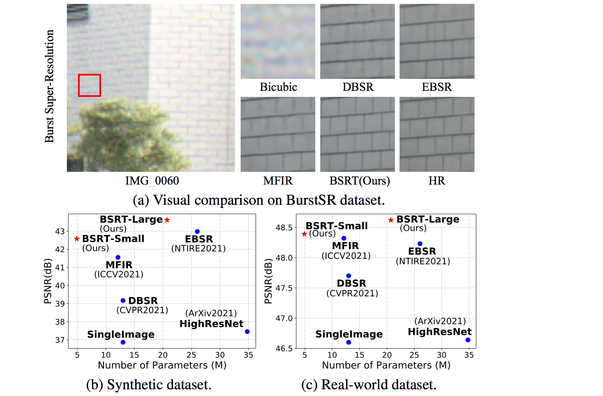

# BSRT: Improving Burst Super-Resolution with Swin Transformer and Flow-Guided Deformable Alignment (CVPRW 2022)
[](https://paperswithcode.com/sota/burst-image-super-resolution-on-burstsr?p=bsrt-improving-burst-super-resolution-with) [](https://paperswithcode.com/sota/burst-image-super-resolution-on?p=bsrt-improving-burst-super-resolution-with)

#### [BSRT](https://arxiv.org/abs/2204.08332), the winner of the NTIRE 2022 Burst Super-Resolution Challenge Real-World Track. 
You can also find our winner method in NTIRE 2021 Burst Super-Resolution Challenge [here](https://github.com/Algolzw/EBSR).

> This work addresses the Burst Super-Resolution (BurstSR) task using a new architecture, which requires restoring a high-quality image from a sequence of noisy, misaligned, and low-resolution RAW bursts. To overcome the challenges in BurstSR, we propose a **B**urst **S**uper-**R**esolution **T**ransformer (**BSRT**), which can significantly improve the capability of extracting inter-frame information and reconstruction. To achieve this goal, we propose a Pyramid Flow-Guided Deformable Convolution Network (Pyramid FG-DCN) and incorporate Swin Transformer Blocks and Groups as our main backbone.  More specifically,  we combine optical flows and deformable convolutions, hence our BSRT can handle misalignment and aggregate the potential texture information in multi-frames more efficiently. In addition, our Transformer-based structure can capture long-range dependency to further improve the performance. The evaluation on both synthetic and real-world tracks demonstrates that our approach achieves a new state-of-the-art in BurstSR task. Further, our BSRT wins the championship in the NTIRE2022 Burst Super-Resolution Challenge.


#### Comparison with State-of-the-art Burst Super-Resolution Methods




## Overview Architecture


## Dependencies
- OS: Ubuntu 18.04
- Python: Python 3.7
- nvidia :
   - cuda: 10.1
   - cudnn: 7.6.1
- Other reference requirements

## Quick Start
1.Create a conda virtual environment and activate it
```python3
conda create -n pytorch_1.6 python=3.7
source activate pytorch_1.6
```
2.Install PyTorch and torchvision following the official instructions
```python3
conda install pytorch==1.6.0 torchvision==0.7.0 cudatoolkit=10.1 -c pytorch
```
3.Install build requirements
```python3
pip3 install -r requirements.txt
```
4.Install DCN
```python3
cd DCNv2
python3 setup.py build develop # build
python3 test.py # run examples and check
```

## Training

We provide all pretrained model weights [here](https://drive.google.com/file/d/1Bv1ZwoE3s8trhG--wjB0Yt6WJIQPpvsn/view?usp=sharing). 

#### For Synthetic data

```python3
cd code/synthetic/bsrt
# Modify the root path of training dataset and model etc.
# The number of GPUs should be more than 1
python main.py --n_GPUs 8 --print_every 40 --lr 0.0001 --decay 150-300 --save bsrt_tiny --model BSRT --fp16 --model_level S --swinfeature --batch_size 32 --burst_size 14 --patch_size 256
```

#### For Real-World data

```python3
cd code/real/bsrt
# Modify the root path of training dataset and model etc.
# The number of GPUs should be more than 1
python main.py --n_GPUs 8 --print_every 20 --lr 0.00005 --decay 40-80 --save bsrt_tiny --model BSRT --fp16 --model_level S --swinfeature --batch_size 8 --burst_size 14 --patch_size 80 --pre_train ../../synthetic/train_log/bsrt/real_models/bsrt_tiny/bsrt_best_epoch.pth 
```

The pretrained PWC-Net model can be downloaded [here](https://drive.google.com/file/d/1dD6vB9QN3qwmOBi3AGKzJbbSojwDDlgV/view?usp=sharing). 

## Test

#### For Synthetic data
```python3
# Modify the path of test dataset and the path of the trained model
python test_synburst.py --n_GPUs 1 --model BSRT --model_level S --swinfeature --burst_size 14 --patch_size 384 --pre_train ../train_log/bsrt/real_models/bsrt_tiny/bsrt_best_epoch.pth --root /data/dataset/ntire21/burstsr/synthetic
```

#### For Real-World data
```python3
# Modify the path of test dataset and the path of the trained model
python test_real.py --n_GPUs 1 --model BSRT --model_level S --swinfeature --batch_size 1 --burst_size 14 --patch_size 80 --pre_train ../train_log/bsrt/real_models/bsrt_tiny/bsrtbest_epoch.pth --root /data/dataset/ntire21/burstsr/real
```

## Results

### Comparison on Synthetic dataset


### Comparison on Real-World dataset


## Citations
If our code helps your research or work, please consider citing our paper.
The following is a BibTeX reference.

```
@article{luo2022bsrt,
  title={BSRT: Improving Burst Super-Resolution with Swin Transformer and Flow-Guided Deformable Alignment},
  author={Luo, Ziwei and Li, Youwei and Cheng, Shen and Yu, Lei and Wu, Qi and Wen, Zhihong and Fan, Haoqiang and Sun, Jian and Liu, Shuaicheng},
  journal={IEEE Conference on Computer Vision and Pattern Recognition (CVPR) Workshops},
  year={2022}
}
```

## Contact
email: [ziwei.ro@gmail.com]
