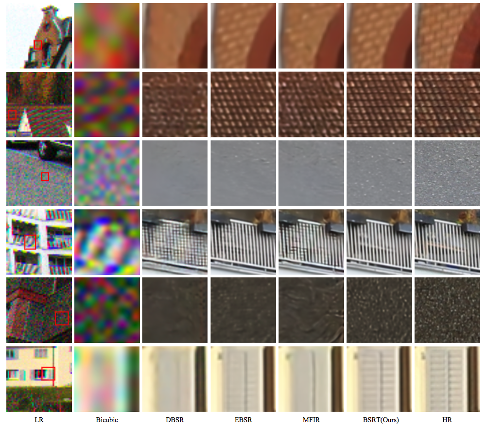

# BSRT: Improving Burst Super-Resolution with Swin Transformer and Flow-Guided Deformable Alignment


## Overview


## Dependencies
- OS: Ubuntu 18.04
- Python: Python 3.7
- nvidia :
   - cuda: 10.1
   - cudnn: 7.6.1
- Other reference requirements

## Quick Start
1.Create a conda virtual environment and activate it
```python3
conda create -n pytorch_1.6 python=3.7
source activate pytorch_1.6
```
2.Install PyTorch and torchvision following the official instructions
```python3
conda install pytorch==1.6.0 torchvision==0.7.0 cudatoolkit=10.1 -c pytorch
```
3.Install build requirements
```python3
pip3 install -r requirements.txt
```
4.Install DCN
```python3
cd DCNv2
python3 setup.py build develop # build
python3 test.py # run examples and check
```
## Training
```python3
# Modify the root path of training dataset and model etc.
# The number of GPUs should be more than 1
python main.py --n_GPUs 8 --print_every 20 --lr 0.00004 --decay 40-80 --save bsrt_tiny --model BSRT --fp16 --model_level S --swinfeature --batch_size 8 --burst_size 14 --patch_size 80 --pre_train ../../synthetic/train_log/bsrt/real_models/bsrt_tiny/bsrt_best_epoch.pth 
```
## Test
```python3
# Modify the path of test dataset and the path of the trained model
python test_real.py --n_GPUs 1 --model BSRT --model_level S --swinfeature --batch_size 1 --burst_size 14 --patch_size 80 --pre_train ../train_log/bsrt/real_models/bsrt_tiny/bsrtbest_epoch.pth --root /data/dataset/ntire21/burstsr/real
```

## Results

### Comparison on Synthetic dataset


### Comparison on Real-World dataset
